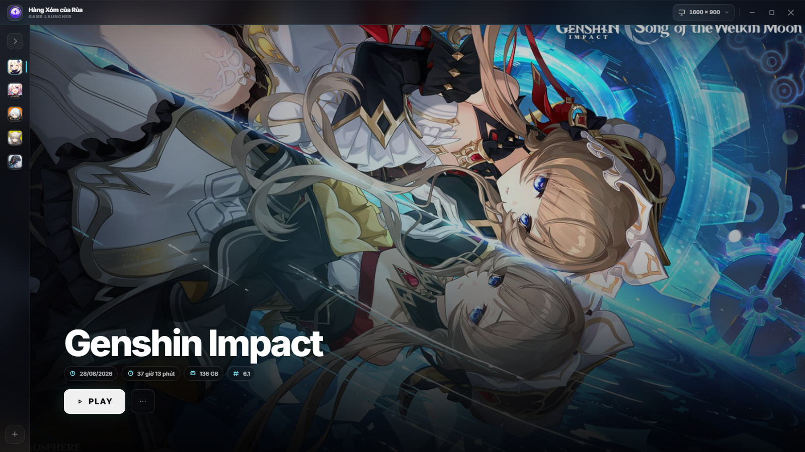
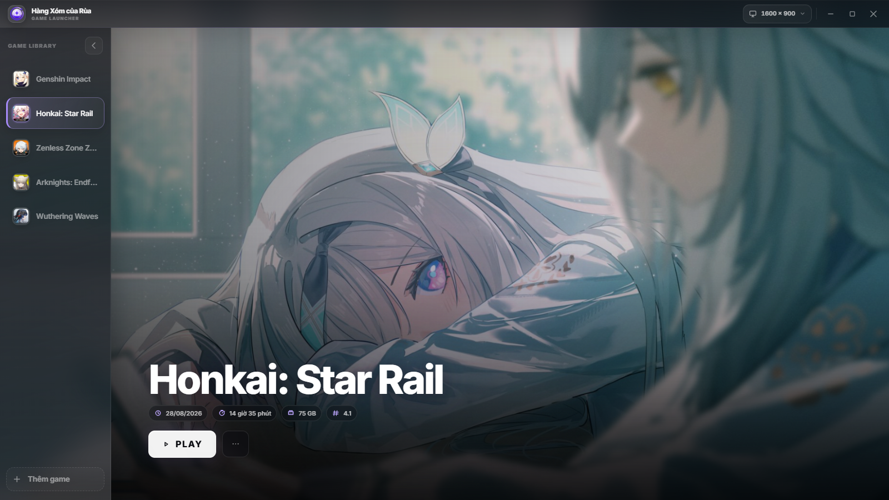

# Hàng Xóm của Rùa

> A personal Windows game launcher for an anime-game library, with per-game artwork, a carousel, and local play metadata.



## About

Hàng Xóm của Rùa is a desktop launcher for keeping a personal game library in one place. Each game has its own executable, logo, wallpaper carousel, visual accent, and basic play information.

It was made to replace a generic desktop shortcut collection with a launcher that feels tailored to the games being played. It is for Windows users who want a lightweight, local-first home for their game library.

## Features

- Add, edit, and remove games from the local library.
- Launch each game through its selected `.exe` file.
- Assign a logo and arrange an image or video carousel for every game.
- Automatically sync carousel media from `carousel/<game-name>/`.
- Choose the primary wallpaper and reposition it directly in the editor.
- Use per-game accents, readable overlays, parallax, and a seven-second carousel.
- Display last played date, accumulated play time, installation size, and patch version when available.
- Resize the launcher manually or choose from presets between 960×540 and 2560×1440.
- Switch to a compact controller window while a game is running.

## Tech Stack

- **Frontend:** React 19, TypeScript, and Zustand.
- **Desktop/runtime:** Electron 43 with Vite and `vite-plugin-electron`.
- **Storage:** Electron Store for local library settings and copied media under the app user-data directory.
- **Tooling:** npm, ESLint, TypeScript, Vite, and electron-builder.

## Screenshots

### Genshin Impact


### Honkai: Star Rail



## Getting Started

### Requirements

- Windows 10 or later.
- Node.js 20 or later and npm.

### Install

```powershell
git clone https://github.com/entering5824/HangXomCuaRua.git
Set-Location HangXomCuaRua
npm install
```

### Development

```powershell
npm run electron:dev
```

The launcher opens in development mode. You can also use `run.bat` on Windows.

### Build

```powershell
npm run lint
npx tsc --noEmit
npm run electron:build:unsigned
```

The unsigned Windows build is written to `release/`.

## Project Structure

```text
src/
├── main/       Electron main process, file access, IPC, persistence, and game launching
├── preload/    Safe Electron APIs exposed to the renderer and compact window
├── renderer/   React interface: pages, components, styles, and UI helpers
├── shared/     IPC contracts, game data types, and accent presets
├── store/      Zustand application state and persistence actions
├── compact/    Compact window UI used while a game is running
└── assets/     Application icon assets
carousel/       Optional source media folders, one folder per game
docs/           README screenshots
```

## How It Works

1. The renderer loads the game library through the preload bridge.
2. The Electron main process reads and writes the library with Electron Store.
3. When a game is added or updated, its selected media is copied into the app user-data directory so the library remains available if the original files move.
4. The selected game supplies its theme, wallpaper, carousel, and metadata to the React interface.
5. Launching a game records runtime state, replaces the main window with the compact controller, then restores the launcher after the game exits.

## Configuration

- `vite.config.mts` configures Vite, the Electron entry points, and the package build.
- `package.json` contains development, linting, and build scripts plus electron-builder settings.
- The project does not require environment variables for normal local use. `VITE_DEV_SERVER_URL` is set by the Electron/Vite development flow.
- Application data is stored by Electron in its Windows user-data directory (normally `%APPDATA%\\Hàng Xóm của Rùa` for the packaged app). Copied media is stored in its `media/` subfolder.
- To import carousel media from the repository, place images or videos in `carousel/<game-name>/` and use **Làm mới từ thư mục carousel** in that game's editor.

## Roadmap

- Library search and filtering.
- Per-game tags and custom collections.
- Backup and restore for the local game library.
- More compact-window controls and richer game status information.

## Known Issues

- Patch-version enrichment is optional and only appears when a compatible planner API is available at `http://localhost:8788/api/planner-data`.
- Installation-size scanning can take time for large game folders; values are cached for 24 hours.
- Carousel folder syncing is currently based on the game name, so renaming a game changes the expected source folder name.

## Notes

- This is a local-first personal launcher: no account, cloud sync, or game-store integration is required.
- The app only launches executable paths selected by the user and does not install or update games.
- Screenshots above are real captures supplied for this project and are committed under `docs/screenshots/`.

## License

Released under the [MIT License](LICENSE).
